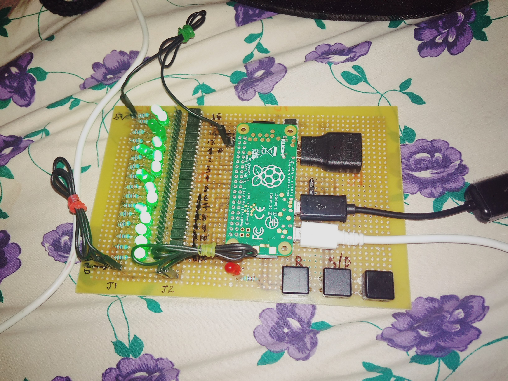
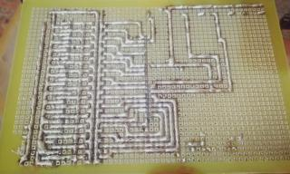

# relay_control_board

##The project houses python script to control relay timings according to the song

---

###This is using rasberry pi zero

---
Pi is used for toggling the states of relays an playing music
the hardware used is :

---

* Raspbery Pi Zero
* Bluetooth speaker
* Relay Controller Shield (That looks like below)

---

